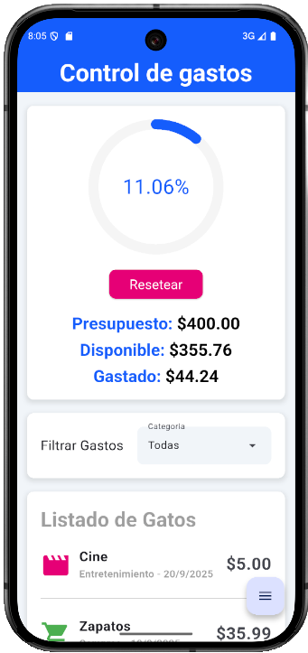
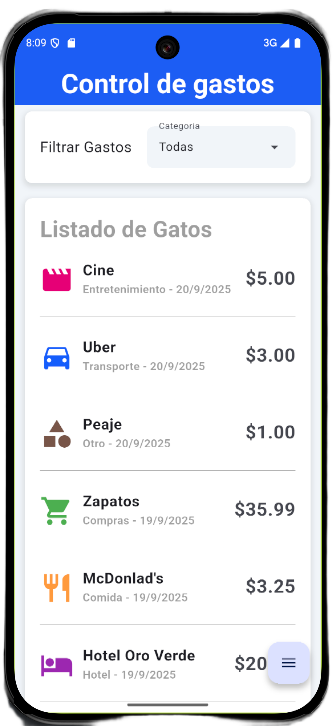
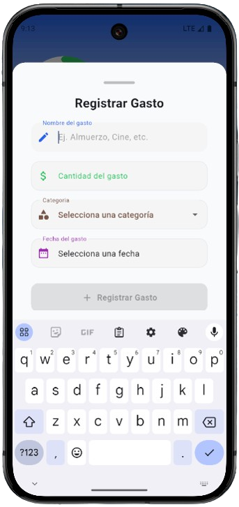

<h1 align="center">📱 Costly - Controla tus gastos de viaje</h1>

  

  <b>Costly</b> es una aplicación móvil simple y práctica para llevar el control de los gastos en tus viajes.  
  La landing page está pensada para presentar la app de manera clara y profesional.

---

## ✨ Características principales
- Registro y visualización de gastos de viaje.
- Organización sencilla y accesible desde cualquier dispositivo.
- Interfaz limpia y fácil de usar.
- Compatible con Android (Pronto en IOS 🚀).

---

## 🌐 Landing Page
👉 Puedes visitar la página aquí: **[Costly Landing Page](https://miportafolio.com/costly)**  

La landing está construida con:
- ⚡ **Astro** como framework.
- 🎨 **TailwindCSS** para estilos responsivos y modernos.

---

## 📸 Capturas de la app
| Dashboard | Lista de gastos | Crear gasto |
|-------|----------------|-------------|
|  |  |  |

---

## 🛠️ Tecnologías usadas en la app
- Flutter
- Dart
- SQLite / Local Database
- Provider (State Management)

---

## 📬 Contacto
Si quieres saber más de mis proyectos:
- LinkedIn: [Christian Arguello](https://www.linkedin.com/in/christianargue/)  
- Email: **christianarguelloo97@gmail.com**

---
